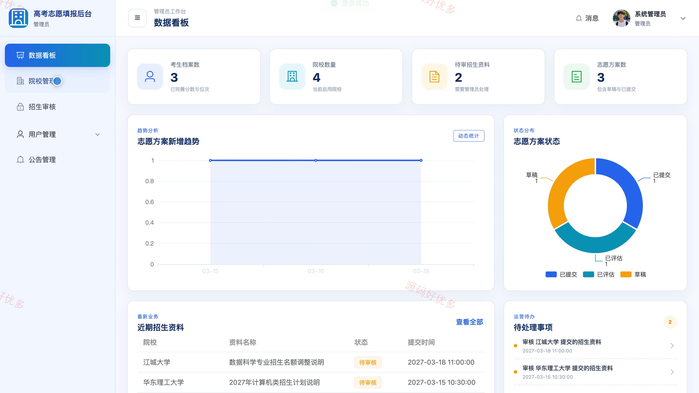
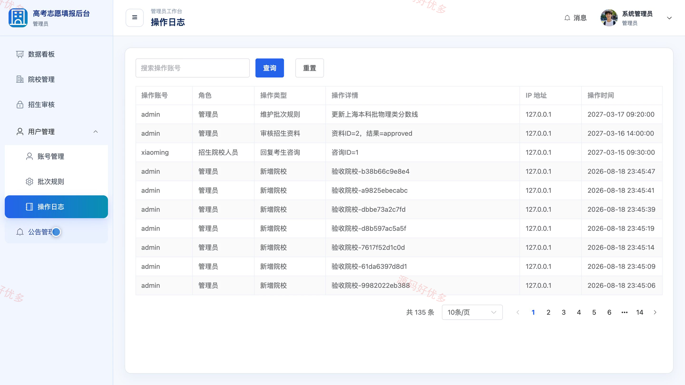
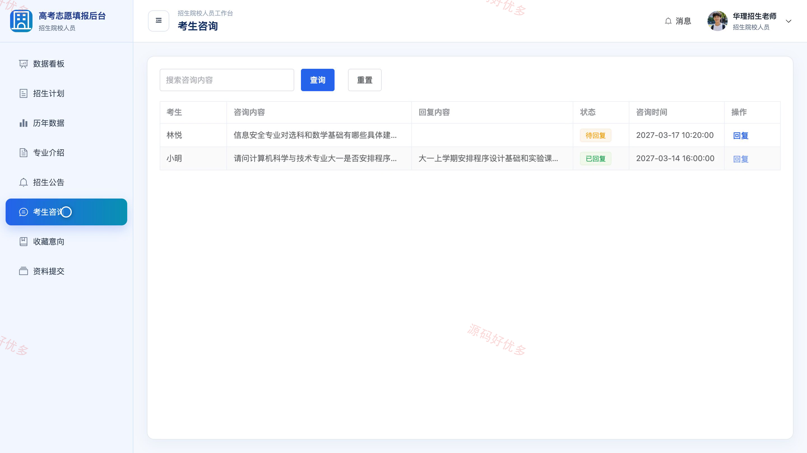

## 源码问题查看主页咨询

### 一、关键词
高考志愿填报、院校专业查询、志愿模拟评估、招生录取信息、升学规划

### 二、作品包含
源码+数据库+全套环境和工具资源+本地部署教程

### 三、项目技术
前端技术： Html、Css、Js、Vue3.4、Element-Plus
后端技术：Java、SpringBoot3.2.0、MyBatis-Plus

### 四、运行环境（以下版本亲测，其他版本兼容性请自行测试）
开发工具：IDEA/eclipse + VSCODE

数据库：MySQL5.7+（共15张表）

数据库管理工具：Navicat10以上版本

环境配置软件： JDK17 + Maven

前端Nodejs：20

浏览器：谷歌浏览器

### 五、项目介绍
项目编号：bs053A

高考志愿填报系统面向考生、招生院校人员和管理员，围绕院校专业查询、历年录取数据、志愿方案评估、招生咨询与资料审核等业务，支持考生依据分数位次规划志愿，并由院校人员维护招生信息、管理员统一审核与管理。

角色：考生、招生院校人员、管理员

考生功能：考生注册与登录、院校专业查询、招生公告查看、个人档案维护、志愿方案编制与评估、院校专业收藏、招生咨询反馈、密码修改。

招生院校人员功能：数据看板、招生计划维护、历年录取数据维护、专业介绍维护、招生公告发布、考生咨询回复、收藏意向统计、招生资料提交。

管理员功能：数据看板、院校信息管理、招生资料审核、账号管理、批次规则管理、招生公告管理、操作日志查看、个人信息维护。

### 六、运行截图

